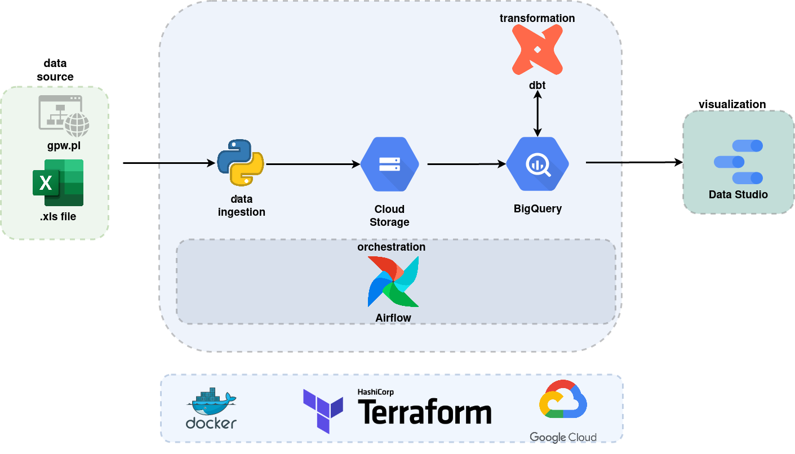

# Warsaw Stock Exchange (GPW) data gathering  pipline

### project description

### architecture diagram 

### Project setup 
The file [instruction.md](https://github.com/skibooj/de_zoomcamp_project/blob/main/instruction.md) contains instructions for configuring the project.

#### demo

at this link is a [report on google data studio](https://datastudio.google.com/reporting/b036b8d6-4788-45f5-8862-1f8e1b88e012